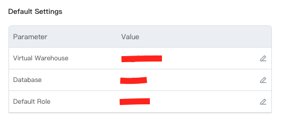

# ByteHouse Python Driver
## Introduction 
ByteHouse provides a Python driver that supports Python Database API Specification v2.0. The driver can be used with 
most client tools/applications/BI tools which accept python driver following python DB API 2.0. The driver uses 
TCP/Native protocol to connect to ByteHouse.

## Requirements
Python v3.6 or higher

## Installation from PyPI
Latest release version can be installed from here:
```commandline
pip install bytehouse-driver
```
## Installation from github
Current development version can be installed from here:
```commandline
pip install git+https://github.com/bytehouse-cloud/driver-py@master#egg=bytehouse-driver
```
## Creating ByteHouse Account
You need to create ByteHouse account in order to use Python Driver. You can simply create a free account with the 
process mentioned in our official website documentation: https://docs.bytehouse.cloud/en/docs/quick-start<br/>

You can also create ByteHouse account through Volcano Engine by ByteDance: 
https://www.volcengine.com/product/bytehouse-cloud

## ByteHouse Gateway Address
Please refer to /tenant/connection in your ByteHouse account for connectivity information.

e.g. 
```
host: gateway.aws-ap-southeast-1.bytehouse.cloud
port: 19000
```
for SG account

## URI format for Connection & Authentication

### Host Address & API Key Format
*Required parameters:* `host` `port` `password`
```python
'bytehouse://{}:{}/?user=bytehouse&password={}'.format(HOST, PORT, API_KEY)
```
## Virtual warehouse & Role Management
Connection initialiaztion with ByteHouse always assumes default virtual warehouse & active role, therefore these values
cannot be empty. So before using the driver, users need to set/ensure these values through 
https://console.bytehouse.cloud/account/details

## Constructing Client Object
### Passing parameters
```python
from bytehouse_driver import Client

client = Client(
    host=HOST,
    port=PORT,
    user='bytehouse',
    password=PASSWORD
)
```
### From URI
```python
from bytehouse_driver import Client

client = Client.from_url('bytehouse://{}:{}/?user=bytehouse&password={}'.format(
        HOST, 
        PORT, 
        PASSWORD
    )
)
```
## Performing SQL queries
```python
from bytehouse_driver import Client

client = Client(
    host=HOST,
    port=PORT,
    user='bytehouse',
    password=PASSWORD
)
# DDL Query
client.execute("CREATE DATABASE demo_db")
client.execute("CREATE TABLE demo_db.demo_tb (id INT) ENGINE=CnchMergeTree() ORDER BY tuple()")

# DML Query
client.execute("INSERT INTO demo_db.demo_tb VALUES", [[1], [2], [3]])

# DQL Query
result_set = client.execute("SELECT * FROM demo_db.demo_tb")
for result in result_set:
    print(result)

client.execute("DROP DATABASE demo_db")
```
## Supported Datatypes
| **ByteHouse type**                                                       | **Python type for INSERT**               | **Python type for SELECT**  |
|----------------------------------------------------------------------|--------------------------------------|-------------------------|
| Integar family (UInt8/UInt16/UInt32/UInt64 / Int8/Int16/Int32/Int64) | `int` `long`                             | `int`                     |
| Float family (Float32/Float64)                                       | `float` `int` `long`                       | `float`                   |
| String                                                               | `str` `bytes`                            | `str` `bytes`               |
| FixedString                                                          | `str` `bytes`                            | `str` `bytes`               |
| Nullable<T>                                                          | `None` `T`                               | `None` `T`                  |
| Date                                                                 | `date` `datetime`                        | `date`                    |
| DateTime                                                             | `datetime` `int` `long`                    | `datetime`                |
| Array                                                                | `list` `tuple`                           | `list`                    |
| Enum family                                                          | `Enum` `int` `long` `str`                    | `str`                     |
| Decimal                                                              | `Decimal` `float` `int` `long`               | `Decimal`                 |
| IP family                                                            | `IPv4Address` `IPv6Address` `int` `long` `str` | `IPv4Address` `IPv6Address` |
| Map                                                                  | `dict`                                 | `dict`                    |
| LowCardinality<T>                                                    | `T`                                    | `T`                       |
| UUID                                                                 | `UUID` `str`                             | `UUID`                    |
### Settings types_check=True
Default value for 'types_check' is false for performance. If set to true, then explicit type checking and transformation
would happen before passing the data onto the server. Recommended to set it to true, for float/decimal or any other 
types, where raw data needs to be transformed into appropriate type. 
### Integer family
`Int8` `Int16` `Int32` `Int64` `UInt8` `UInt16` `UInt32` `UInt64`
```python
client.execute("CREATE TABLE demo_db.demo_tb (a Int8, b Int16, c Int32, d Int64, e UInt8, f UInt16, g UInt32, h UInt64) ENGINE=CnchMergeTree() ORDER BY tuple()")
data = [
    (-10, -300, -123581321, -123581321345589144, 10, 300, 123581321, 123581321345589144)
]
client.execute("INSERT INTO demo_db.demo_tb VALUES", data)
```
### Float family
`Float32` `Float64`
```python
client.execute("CREATE TABLE demo_db.demo_tb (a Float32, b Float64) ENGINE=CnchMergeTree() ORDER BY tuple()")
data = [
    (3.4028235e38, 3.4028235e38),
    (3.4028235e39, 3.4028235e39),
    (-3.4028235e39, 3.4028235e39),
    (1, 2)
]
client.execute("INSERT INTO demo_db.demo_tb VALUES", data, types_check=True)
```
### String
```python
client.execute("CREATE TABLE demo_db.demo_tb (a String) ENGINE=CnchMergeTree() ORDER BY tuple()")
data = [('axdfgrt', )]
client.execute("INSERT INTO demo_db.demo_tb VALUES", data)
```
### FixedString
```python
client.execute("CREATE TABLE demo_db.demo_tb (a FixedString(4)) ENGINE=CnchMergeTree() ORDER BY tuple()")
data = [('a', ), ('bb', ), ('ccc', ), ('dddd', ), ('я', )]
client.execute("INSERT INTO demo_db.demo_tb VALUES", data)
```
### Nullable
```python
client.execute("CREATE TABLE demo_db.demo_tb (a Nullable(Int32)) ENGINE=CnchMergeTree() ORDER BY tuple()")
data = [(3, ), (None, ), (2, )]
client.execute("INSERT INTO demo_db.demo_tb VALUES", data)
```
### Date
```python
from datetime import date, datetime

client.execute("CREATE TABLE demo_db.demo_tb (a Date) ENGINE=CnchMergeTree() ORDER BY tuple()")
data = [(date(1970, 1, 1), ), (datetime(2015, 6, 6, 12, 30, 54), )]
client.execute("INSERT INTO demo_db.demo_tb VALUES", data)
```
### DateTime
```python
from datetime import datetime

client.execute("CREATE TABLE demo_db.demo_tb (a DateTime) ENGINE=CnchMergeTree() ORDER BY tuple()")
data = [(datetime(2015, 6, 6, 12, 30, 54), ), (1530211034,)]
client.execute("INSERT INTO demo_db.demo_tb VALUES", data)
```
### Array
```python
client.execute("CREATE TABLE demo_db.demo_tb (a Array(Int32)) ENGINE=CnchMergeTree() ORDER BY tuple()")
data = [([], ), ([100, 500], )]
client.execute("INSERT INTO demo_db.demo_tb VALUES", data)
```
### Enum family
`Enum8` `Enum16`
```python
from enum import IntEnum

class A(IntEnum):
    hello = -1
    world = 2

class B(IntEnum):
    foo = -300
    bar = 300

client.execute("CREATE TABLE demo_db.demo_tb (a Enum8('hello' = -1, 'world' = 2), b Enum16('foo' = -300, 'bar' = 300)) ENGINE=CnchMergeTree() ORDER BY tuple()")
data = [(A.hello, B.bar), (A.world, B.foo), (-1, 300), (2, -300)]
client.execute("INSERT INTO demo_db.demo_tb VALUES", data)
```
### Decimal
```python
from decimal import Decimal

client.execute("CREATE TABLE demo_db.demo_tb (a Decimal(9, 5)) ENGINE=CnchMergeTree() ORDER BY tuple()")
data = [(Decimal('300.42'),), (300.42,), (-300,)]
client.execute("INSERT INTO demo_db.demo_tb VALUES", data, types_check=True)
```
### IP family
`IPv4` `IPv6`
```python
from ipaddress import IPv6Address, IPv4Address

client.execute("CREATE TABLE demo_db.demo_tb (a IPv4, b IPv6) ENGINE=CnchMergeTree() ORDER BY tuple()")
data = [
    (IPv4Address("10.0.0.1"), IPv6Address('79f4:e698:45de:a59b:2765:28e3:8d3a:35ae'),),
]
client.execute("INSERT INTO demo_db.demo_tb (a, b) VALUES", data)
```
### Map
```python
client.execute("CREATE TABLE demo_db.demo_tb (a Map(String, UInt64)) ENGINE=CnchMergeTree() ORDER BY tuple()")
data = [
    ({},),
    ({'key1': 1},),
    ({'key1': 2, 'key2': 20},),
    ({'key1': 3, 'key2': 30, 'key3': 50},)
]
client.execute("INSERT INTO demo_db.demo_tb VALUES", data)
```
### LowCardinality
```python
client.execute("CREATE TABLE demo_db.demo_tb (a LowCardinality(UInt8)) ENGINE=CnchMergeTree() ORDER BY tuple()")
data = [(x,) for x in range(255)]
client.execute("INSERT INTO demo_db.demo_tb VALUES", data)
```
### UUID
```python
from uuid import UUID

client.execute("CREATE TABLE demo_db.demo_tb (a UUID) ENGINE=CnchMergeTree() ORDER BY tuple()")
data = [
    (UUID('c0fcbba9-0752-44ed-a5d6-4dfb4342b89d'),),
    ('2efcead4-ff55-4db5-bdb4-6b36a308d8e0',)
]
client.execute("INSERT INTO demo_db.demo_tb VALUES", data)
```
## Cursor Support: DB API 2.0
Cursors are supported following DB API 2.0 specifications. Cursors are created by the connection.cursor() method. They 
are bound to the connection for the entire lifetime and all the commands are executed in the context of the database 
session wrapped by the connection.
```python
from bytehouse_driver import connect

kwargs = {}
kwargs.setdefault('host', HOST)
kwargs.setdefault('port', PORT)
kwargs.setdefault('user', 'bytehouse')
kwargs.setdefault('password', PASSWORD)

connection = connect(**kwargs)
cursor = connection.cursor()

cursor.execute("DROP TABLE IF EXISTS cursor_tb")
cursor.execute("CREATE TABLE cursor_tb (id INT) ENGINE=CnchMergeTree() ORDER BY tuple()")

cursor.executemany("INSERT INTO cursor_tb (id) VALUES", [{'id': 100}])

result_set = cursor.execute("SELECT * FROM cursor_tb")
for result in result_set:
    print(result)

connection.close()
```
## User defined query-id
User can manually supply query-id for each query execution. Users are encouraged to maintain uniqueness or relevancy 
of the query-id string. If not set, then server will assign a randomly generated UUID as the query-id. 
```python
client = Client(
    host=HOST,
    port=PORT,
    user='bytehouse',
    password=PASSWORD
)
client.execute("SELECT 1", query_id="ba2e2cea-2a11-4926-a0b8-e694ded0cf65")
```
## Local Development
Change `setup.cfg` file to include your connection credentials. For running tests locally, follow these steps:
```python
python testsrequire.py && python setup.py develop
py.test -v
```
## Issue Reporting
If you have found a bug or if you have a feature request, please report them at this repository issues section. 
Alternatively, you can directly create an issue with our support platform here: https://bytehouse.cloud/support
## Original Author
ByteHouse wants to thank original author @Konstantin Lebedev & ClickHouse for original contribution to this driver. 
## License
This project is distributed under the terms of the MIT license: http://www.opensource.org/licenses/mit-license.php

